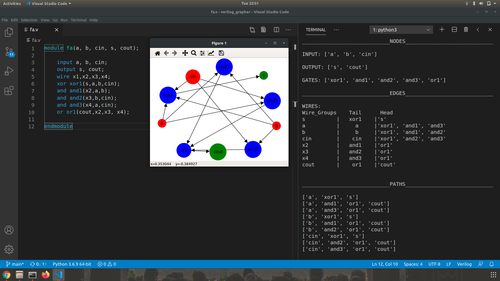

# verilog_grapher
Visualize your gate-level verilog code as a directed graph. **networkx** library was used to draw the graphs

## Running
Run the following command:
```
python3 main.py <path-to-verilog-file>
```
<br>

<br>

## Improvements!
1. Improve the parser
2. Improve the positioning of nodes in graph
